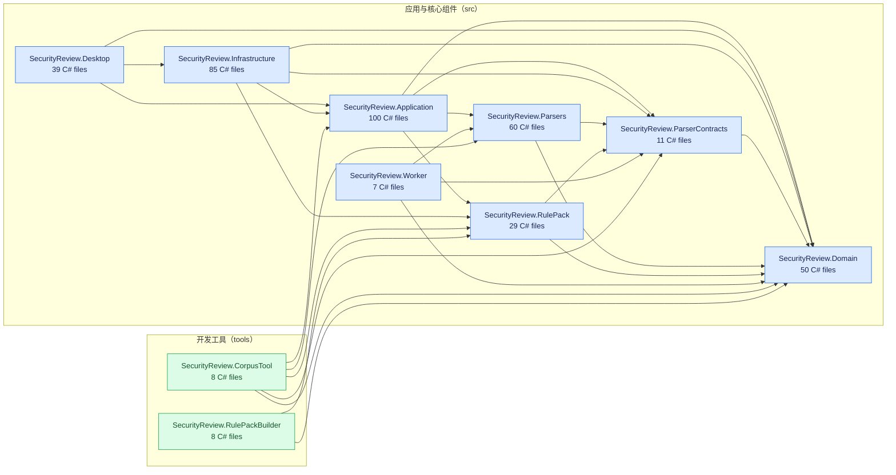

# Code Graph

> 此文件由 `build/update-code-graph.ps1` 生成；请勿手工修改。

本图覆盖 `src/` 与 `tools/` 中的项目。箭头 `A --> B` 表示项目 A 直接引用项目 B；测试项目未纳入，以保持运行时代码的依赖关系清晰。

更新：`pwsh ./build/update-code-graph.ps1`。验证生成文件没有过期：`pwsh ./build/update-code-graph.ps1 -Check`。

## 项目清单

| 项目 | 路径 | C# 文件 | 直接依赖 |
| --- | --- | ---: | --- |
| SecurityReview.Application | `src/SecurityReview.Application/SecurityReview.Application.csproj` | 100 | SecurityReview.Domain, SecurityReview.ParserContracts, SecurityReview.Parsers, SecurityReview.RulePack |
| SecurityReview.Desktop | `src/SecurityReview.Desktop/SecurityReview.Desktop.csproj` | 39 | SecurityReview.Application, SecurityReview.Domain, SecurityReview.Infrastructure |
| SecurityReview.Domain | `src/SecurityReview.Domain/SecurityReview.Domain.csproj` | 50 | — |
| SecurityReview.Infrastructure | `src/SecurityReview.Infrastructure/SecurityReview.Infrastructure.csproj` | 85 | SecurityReview.Application, SecurityReview.Domain, SecurityReview.ParserContracts, SecurityReview.RulePack |
| SecurityReview.ParserContracts | `src/SecurityReview.ParserContracts/SecurityReview.ParserContracts.csproj` | 11 | SecurityReview.Domain |
| SecurityReview.Parsers | `src/SecurityReview.Parsers/SecurityReview.Parsers.csproj` | 60 | SecurityReview.Domain, SecurityReview.ParserContracts |
| SecurityReview.RulePack | `src/SecurityReview.RulePack/SecurityReview.RulePack.csproj` | 29 | SecurityReview.Domain, SecurityReview.ParserContracts |
| SecurityReview.Worker | `src/SecurityReview.Worker/SecurityReview.Worker.csproj` | 7 | SecurityReview.Domain, SecurityReview.ParserContracts, SecurityReview.Parsers |
| SecurityReview.CorpusTool | `tools/SecurityReview.CorpusTool/SecurityReview.CorpusTool.csproj` | 8 | SecurityReview.Application, SecurityReview.Domain, SecurityReview.ParserContracts, SecurityReview.Parsers, SecurityReview.RulePack |
| SecurityReview.RulePackBuilder | `tools/SecurityReview.RulePackBuilder/SecurityReview.RulePackBuilder.csproj` | 8 | SecurityReview.Domain, SecurityReview.RulePack |
