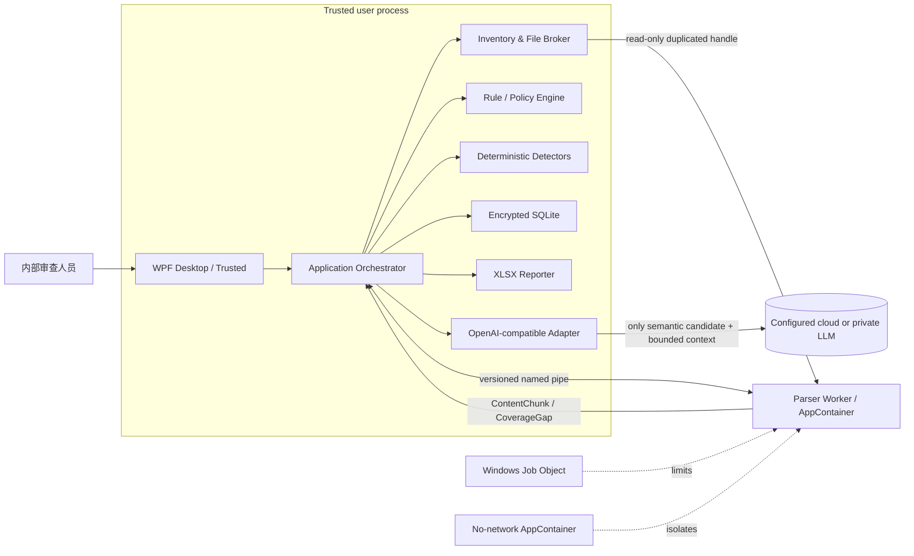
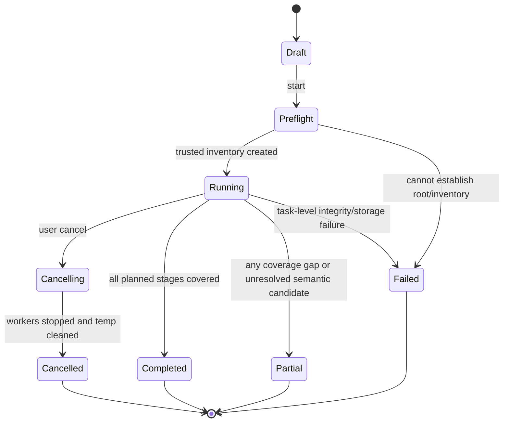

# 软件需求与技术方案（SRS）：项目资产安全信息审查工具

| 属性 | 值 |
| --- | --- |
| 文档版本 | 0.2 |
| 日期 | 2026-07-22 |
| 状态 | 技术方案基线，待实施前置项关闭 |
| 上游需求 | `docs/prd/prd-security-asset-content-review-tool.md` |
| 目标平台 | Windows 11 x64；仍在微软支持期内的 Windows 10 Enterprise/IoT LTSC x64 |
| 第一版技术栈 | C# / .NET 10 LTS / WPF / Microsoft.Data.Sqlite |
| 交付形态 | `win-x64` 自包含当前用户安装器 + 便携目录 ZIP；无服务和自动更新 |

## 1. 目的和设计结论

本文将 PRD 中 19 条产品需求和 60 条验收标准转换为可实现、可验证的软件需求。第一版采用 **Windows 原生模块化单体 + AppContainer 隔离解析工作进程**：

- WPF 主进程是可信协调器，负责界面、文件清单、规则、本地检测、LLM、历史和报告；
- 所有不可信格式解析都在无网络 capability 的 AppContainer 子进程中进行；
- 主进程以只读文件句柄而不是任意路径授权解析器访问输入；
- Job Object 限制解析器进程树、内存、CPU 和生命周期；
- 命名管道承载版本化进程间协议；
- 完整敏感值和历史以 AES-256-GCM 加密，数据密钥由当前 Windows 用户的 DPAPI 保护；
- 唯一允许的网络流量由主进程按需发往用户配置的 OpenAI 兼容 LLM（云上 HTTPS 或受限内网端点）；
- 任何未支持、失败、排除、超限、加密或未完成语义复核的内容都形成覆盖缺口，任务不能显示为“完成”。

工具只扫描、定位、辅助复核并导出证据，不修改资产、不执行发布拦截，也不作绝对安全保证。

## 2. 范围、假设和兼容性修正

### 2.1 范围

范围与 PRD 第一版一致：文件、目录、Docker TAR、OCI Image Layout，常见文本和结构化格式、Open XML、可提取文本 PDF、归档、Python、JAR、PE/ELF、模型安全元数据；本地检测与内网 LLM；历史、复核、例外、差异、缓存和固定六 Sheet XLSX。

明确不包含：资产执行、动态分析、完整反编译/反汇编、OCR、旧版 Office 正文、加密文件破解、模型权重泄漏证明、Docker 引擎连接、Git 历史解析、中心服务、权限系统和 XLSX 之外的报告格式。

### 2.2 假设

1. 正式审查输入是稳定的最终待发布产物，且单任务最多约 10 GB、10 万文件。
2. 云上或内网 LLM 能提供 OpenAI 兼容的 `chat/completions` 接口；具体端点类型、认证头、模型和并发限制在实施前配置。
3. 所有本机用户均为可信内部人员；应用不提供本机内部 RBAC。
4. 规则签名私钥由规则发布流程持有，绝不进入客户端；客户端只内置受信公钥。
5. 第一版只支持 `win-x64`，每次只运行一个活动扫描任务。

### 2.3 Windows 支持口径修正

PRD 写作“Windows 10/11 x64”。截至本文日期，.NET 10 的官方支持矩阵不再包含普通 Windows 10 22H2，只包含仍受支持的 Windows 10 Enterprise/IoT LTSC 版本。因此发布口径收敛为：

- Windows 11 x64；
- 仍处于微软支持期内、同时列入 .NET 10 支持矩阵的 Windows 10 Enterprise/IoT LTSC x64。

正式开发前必须收集办公终端实际版本和版本分布。若必须支持已停止支持的 Windows 10 版本，需要重新选择运行时并单独接受运行时安全维护风险，不能静默宣称支持。

### 2.4 交付与本地数据定义

安装版以当前用户身份安装到 `%LOCALAPPDATA%\Programs\SecurityReviewTool\`，不得请求管理员权限、写入机器级配置、安装服务或创建计划任务；便携版仍支持解压即用。两种交付方式共享同一运行数据目录，卸载应用默认保留这些数据：

```text
%LOCALAPPDATA%\SecurityReviewTool\
  config\          # 非秘密配置和 DPAPI 密文
  data\history.db  # 本地历史与缓存
  rules\           # 当前及历史规则包
  temp\            # 任务级临时数据
  diagnostics\     # 脱敏运行日志
```

AppContainer profile 是当前 Windows 用户的系统级隔离对象。卸载说明必须提供“清除本地数据与隔离配置”的显式操作。

## 3. 架构

### 3.1 运行时视图



### 3.2 进程和信任边界

| 进程/边界 | 信任级别 | 责任 | 明确禁止 |
| --- | --- | --- | --- |
| `SecurityReviewTool.exe` | 可信 | WPF、编排、文件清单与摘要、规则、检测、LLM、存储、导出 | 执行资产；把确定性完整秘密发送给 LLM |
| `SecurityReview.Worker.exe` | 不可信解析边界 | 识别格式、受限递归解析、输出规范化内容和位置 | 网络、凭据、数据库、用户目录枚举、规则变更、LLM、资产执行 |
| AppContainer | OS 安全边界 | 给 worker 最小 token、私有目录和无网络 capability | 无受控句柄时访问扫描资产 |
| Job Object | 资源边界 | 限制活动进程、内存、CPU；父进程退出时杀死 worker 树 | 子进程逃逸、无限资源占用 |
| 云上或内网 LLM | 外部于本机信任边界 | 仅对语义候选给出结构化辅助判断 | 文件访问、工具调用、发布判断、规则覆盖 |

解析 worker 不能获得 API Key、DPAPI 密文、规则签名私钥或历史数据库路径。主进程崩溃或关闭 Job handle 时，设置 `JOB_OBJECT_LIMIT_KILL_ON_JOB_CLOSE` 的 worker 进程树必须退出。

### 3.3 模块边界与依赖规则

建议解决方案结构：

```text
src/
  SecurityReview.Desktop/          # WPF composition root and views
  SecurityReview.Application/      # use cases, orchestration, ports
  SecurityReview.Domain/           # entities, policies, state machines
  SecurityReview.Infrastructure/   # SQLite, DPAPI, OpenAI, file broker
  SecurityReview.Worker/           # sandboxed parser host
  SecurityReview.ParserContracts/  # IPC DTOs and protocol version
  SecurityReview.Parsers/           # OpenXML/PDF/archive/etc.; used only by Worker
  SecurityReview.RulePack/          # schema, validation, evaluation
  SecurityReview.RulePackBuilder/   # offline Excel -> signed package CLI
tests/
  Unit/ Contract/ Integration/ Corpus/ WindowsSecurity/ UI/ Performance/
```

依赖必须指向内层：Desktop/Infrastructure/Worker 依赖 Application/Domain/Contracts；Domain 不依赖 WPF、SQLite、HTTP、Open XML 或具体解析库。Parser 项目不引用 Storage、LLM 或 Desktop。外部库一律包在 adapter 后，避免其 API 渗入 Domain。

### 3.4 领域上下文

| 上下文 | 核心职责 | 主要输出 |
| --- | --- | --- |
| Scan Orchestration | 状态机、阶段、取消、重试、进度、任务恢复 | `ScanRun`, progress events |
| Inventory & Coverage | 根路径边界、ADS、重解析点、格式探测、摘要、覆盖账本 | `FileRecord`, `CoverageGap` |
| Parser Sandbox | 受限格式解析和规范化位置 | `ContentChunk` |
| Rule & Policy | 规则包验证、通用/专项/合规策略合并 | effective policy fingerprint |
| Detection | 确定性、词典、结构、指纹和语义候选 | `DetectionCandidate` |
| Semantic Review | 最小化、遮盖、LLM 契约、重试和回退 | `LlmReview` |
| Finding & Review | 分组、位置、人工状态、例外和差异 | findings and decisions |
| Persistence | 加密历史、严格缓存、保留清理 | durable local state |
| Reporting | 固定六 Sheet、安全单元格、导出摘要 | `.xlsx` |

## 4. 功能软件需求

下列需求均为“必须（MUST）”。详细算法和契约见后续章节。

| SRS ID | 软件需求 | 上游 | 验证 |
| --- | --- | --- | --- |
| SRS-F-001 | 提供简体中文 WPF `win-x64` 自包含当前用户安装器和便携目录；安装器无需管理员权限且完成页可直接启动；不安装服务或自动更新器，并在 5 秒目标内显示可交互主窗体。 | REQ-001 / AC-001 | VT-001, VT-002 |
| SRS-F-002 | 扫描开始时生成规范输入清单和 SHA-256；读取后再次验证长度、时间和摘要，变化时重试一次，再变则记录不稳定并判为部分完成；报告与摘要绑定。 | REQ-002 / AC-002, AC-003, AC-004 | VT-003 |
| SRS-F-003 | 读取根目录 `security-asset-manifest.json`；允许 UI 补录资产类型、路径映射和证据；未知路径仍应用全部 8 类基础规则。 | REQ-003 / AC-005, AC-006 | VT-004 |
| SRS-F-004 | 枚举普通、隐藏、系统文件和 NTFS ADS；不越过根目录跟随重解析点；以文件签名和内部结构选择解析器，并报告扩展名不一致。 | REQ-004 / AC-007, AC-008, AC-009 | VT-005, VT-006 |
| SRS-F-005 | 流式解析支持的文本、JSON、YAML、XML、CSV、Open XML、PDF 和归档；记录编码与格式专用位置；不可靠解码和不支持区域必须形成覆盖缺口。 | REQ-005 / AC-010, AC-011, AC-012 | VT-007, VT-008 |
| SRS-F-006 | Python 定位到行列；JAR 扫描资源、嵌套归档和 JVM 常量池；PE/ELF 扫描元数据、资源和可提取字符串并记录字节偏移；永不执行或完整反编译。 | REQ-006 / AC-013, AC-014, AC-015 | VT-009 |
| SRS-F-007 | 无 Docker 依赖地解析 Docker archive 或 OCI Image Layout 的 manifest/config/history/env/labels 和全部 layer，保留早期层已删除内容的位置。 | REQ-007 / AC-016, AC-017 | VT-010 |
| SRS-F-008 | 所有资产解析在无网络 AppContainer worker 中完成；使用只读句柄、Job Object、归档限制和任务临时边界；worker 失败只形成覆盖缺口且不终止任务。 | REQ-008 / AC-018, AC-019, AC-020, AC-021 | VT-011, VT-012, VT-013, VT-014 |
| SRS-F-009 | 有效策略始终包含 8 类基础规则，再叠加资产专项和合规规则；专项规则不得削弱基础规则；合规证据缺失输出“无法验证”。 | REQ-009 / AC-022, AC-023, AC-024 | VT-015 |
| SRS-F-010 | 客户端只启用结构、版本、引用、哈希和 ECDSA 签名均有效的离线规则包；保留历史版本并显著提示旧版扫描；本地补充只能增加规则。 | REQ-010 / AC-025, AC-026, AC-027 | VT-016 |
| SRS-F-011 | 检测管线组合线性时间正则、校验器、熵、结构字段、网络解析、词典、Aho-Corasick、许可证/内容指纹和语义候选器；每个候选保留 detector ID。 | REQ-011 / AC-028, AC-029, AC-030, AC-031 | VT-017 |
| SRS-F-012 | 仅主进程调用配置的 OpenAI 兼容端点（云上 HTTPS 或受限内网端点）；每次发送一个经最小化和遮盖的语义候选；固定无工具提示词和严格结构输出；异常结果回退人工。 | REQ-012 / AC-032, AC-033, AC-034, AC-035 | VT-018, VT-019, VT-020 |
| SRS-F-013 | 每个发现保存完整值、有限上下文、规则/检测器/模型轨迹、独立严重度与置信度及可复现位置；UI 按指纹分组但保留每一位置；结论遵守有界口径。 | REQ-013 / AC-036, AC-037, AC-038, AC-039, AC-040 | VT-021 |
| SRS-F-014 | 保存人工判定和当前 Windows 用户；例外精确绑定资产/位置/内容/规则/期限；复扫计算差异；仅完整阶段指纹一致时使用缓存。 | REQ-014 / AC-041, AC-042, AC-043, AC-044 | VT-022, VT-023 |
| SRS-F-015 | 在当前用户目录保存 AES-256-GCM 加密敏感字段，数据密钥由 DPAPI CurrentUser 保护；默认保留 90 天并支持 30/180 天、永久和一键清除。 | REQ-015 / AC-045, AC-046, AC-047 | VT-024, VT-025 |
| SRS-F-016 | 只导出固定六 Sheet XLSX；完整值每个位置一行；所有资产来源字符串写为文本，且包中不得含公式、宏、超链接或外部关系。 | REQ-016 / AC-048, AC-049, AC-050 | VT-026, VT-027 |
| SRS-F-017 | UI 持续显示阶段、文件/字节/失败/LLM 队列；取消后 2 秒内停止新调度；提供筛选、分组、只读预览和外部打开警示。 | REQ-017 / AC-051, AC-052, AC-053, AC-054 | VT-028, VT-029 |
| SRS-F-018 | 版本化合成/脱敏语料作为发布门：确定性高风险预期样例 100% 检出，固定模型语义召回率不低于 95%，所有预期覆盖缺口均被记录。 | REQ-018 / AC-055, AC-056, AC-057 | VT-030, VT-031, VT-032 |
| SRS-F-019 | 默认无遥测；除配置的 LLM 目标外不得发起网络请求；日志和用户主动导出的诊断包不得包含正文、完整值、请求正文或敏感完整路径。 | REQ-019 / AC-058, AC-059, AC-060 | VT-033, VT-034, VT-035 |

### 4.1 扫描状态机



终态由覆盖账本计算，不能由发现数量计算。应用下次启动时将未进入终态的任务标记为 `Interrupted`，清理孤立 worker/temp，保留已经事务提交的结果，并在 UI 映射为失败或已取消，不能自动称为完成。

### 4.2 主流程和异常流程

1. **Preflight**：规范化根路径，读取/补录 Manifest，加载规则与本地补充，测试磁盘空间和 AppContainer，建立预清单；失败时不创建形式上的“扫描结果”。
2. **Inventory**：在根边界内枚举条目、ADS 和重解析点，读取文件签名并计算 SHA-256；不可访问项直接进入 coverage ledger。
3. **Parse**：协调器打开文件只读句柄，启动/选择 worker，将句柄复制到 worker；worker 输出规范化 chunk 或 gap。
4. **Detect**：基础、专项、合规检测器运行；确定性发现直接落库，语义候选进入队列。
5. **Semantic review**：可用时调用内网 LLM；非法/超时结果保留 unresolved；用户可单独重试该阶段。
6. **Finalize**：复核摘要、重新计算文件摘要；一次变化则重新扫描该文件，第二次变化标记 unstable；提交终态。
7. **Review/export/rescan**：人工复核不修改资产；复扫使用严格缓存并生成差异；导出采用临时文件验证后原子替换。

任务级完整性、数据库写入或规则加载失败导致 `Failed`。单文件无权限、损坏、不支持、超限、worker 崩溃或 LLM 候选未完成只导致该项 `CoverageGap` 和任务 `Partial`。

## 5. 输入清单、文件代理和覆盖账本

### 5.1 Manifest

第一版约定根目录可选文件 `security-asset-manifest.json`，UTF-8、JSON Schema 版本 `1`：

```json
{
  "schema_version": 1,
  "asset_id": "project-asset-id",
  "asset_version": "2026.07.20",
  "components": [
    {"path": ".", "asset_type": "ASSET-009"},
    {"path": "docs", "asset_type": "ASSET-005"}
  ],
  "compliance_evidence": {
    "knowledge_base_transformed": {"status": "not_applicable", "reference": null},
    "model_finetuned": {"status": "not_applicable", "reference": null},
    "third_party_authorizations": []
  }
}
```

Schema 拒绝绝对路径、`..`、根外路径、未知资产 ID 和重复冲突映射。Manifest 是证据声明，不因其存在而跳过内容扫描；无可验证引用时合规状态仍可为“无法验证”。UI 补录生成任务内快照，不写回资产。

### 5.2 清单一致性

每个文件记录 `relative_path_fingerprint`, `stream_name`, `length`, `last_write_utc`, `file_identity`, `sha256`, `format_id`, `inventory_status`。路径以根目录相对路径展示，数据库中完整路径加密。扫描前后比较长度、时间和 SHA-256；只依赖时间戳不足以判定稳定。

目录遍历规则：

- 使用 Windows API 识别 file ID 和 reparse tag；默认不跟随任何重解析点；只有解析后仍位于根内的普通链接可在 UI 明确选择跟随，但第一版正式扫描默认关闭；
- 隐藏和系统属性不构成排除；
- NTFS 卷使用 `FindFirstStreamW/FindNextStreamW` 枚举非默认 ADS；非 NTFS 不声称具备 ADS 能力；
- 路径、文件名、ADS 名本身也作为内容单元检测；
- 读取时设置共享读取/删除语义并以已打开句柄为权威，避免路径再次解析造成 TOCTOU；
- 用户排除项在预扫描确认中列出，并逐项生成 `user_excluded` gap。

### 5.3 覆盖账本

每个计划扫描单元必须产生且只产生一个终结覆盖结果：`covered`, `partially_covered`, `not_covered`。Gap 至少包含：

```text
gap_id, scan_id, file_id, virtual_path, format_id,
stage, reason_code, parser_id/version, detail_code,
planned_bytes, processed_bytes, created_at
```

标准 `reason_code`：`unsupported_format`, `unsupported_region`, `access_denied`, `encrypted`, `decode_unreliable`, `corrupt`, `archive_limit`, `parser_timeout`, `parser_memory`, `parser_crash`, `sandbox_unavailable`, `file_unstable`, `user_excluded`, `llm_unresolved`, `cancelled`, `disk_full`, `unexpected_git_metadata`。

自由文本错误必须脱敏；原始异常栈只在不含资产值和完整路径时保留。

## 6. 解析隔离与格式适配

### 6.1 Worker 启动协议

1. 首次运行以当前用户创建固定名称派生的 AppContainer profile，取得 SID；worker 二进制及只读依赖复制到 profile 可读目录并校验发行 manifest SHA-256。
2. 主进程创建随机管道名和只允许当前用户 SID、该 AppContainer SID 访问的 ACL。
3. 使用 `STARTUPINFOEX` 和 `PROC_THREAD_ATTRIBUTE_SECURITY_CAPABILITIES` 创建无网络 capability 的 suspended worker；不授予 `internetClient`、私网或任意文件系统 capability。
4. 把 worker 加入 Job Object，设置活动进程数、进程/Job 内存和 `KILL_ON_JOB_CLOSE`。
5. 主进程用 `DuplicateHandle` 复制已只读打开的输入 handle 到 worker，发送含数值 handle 的 `ParseJob`，再恢复/调度 worker。
6. worker 只能使用该 handle 和私有临时目录；协议握手必须验证版本、随机 nonce、worker build hash 和 AppContainer SID。

AppContainer 建立、ACL 或无网络验证失败时，正式扫描必须 fail closed，不允许悄悄退回普通用户权限进程。UI 显示可定位的环境修复信息。

### 6.2 资源限制默认值

| 限制 | 默认值 | 触发行为 |
| --- | --- | --- |
| 并行 worker | `min(4, max(2, logical_cpu/2))`，且总内存受 1.0 GB Job 上限约束 | 背压，不继续启动 |
| 普通文件解析 | 每文件 120 秒、每 worker 384 MB | 终止 worker，记录 gap，重建 worker |
| Docker/OCI 顶层任务 | 单 worker 最多 30 分钟、1.0 GB；仍受任务总目标约束 | 记录未完成层和 gap |
| 归档嵌套深度 | 5 层 | 停止该分支 |
| 单任务归档条目 | 100,000 | 停止新增条目 |
| 逻辑展开总量 | 50 GB 或输入大小的 100 倍，先到者 | 停止危险分支 |
| 单条目大小 | 4 GB | 不展开并记录 gap |
| 内容 chunk | 最大 1 MiB，4 KiB 重叠 | 保留跨边界检测能力 |
| IPC frame | 最大 1 MiB | 断开违规 worker |
| 可提取字符串 | 最小 6 字符；单字符串最大 1 MiB | 超长分块并保留偏移 |

数值由签名规则/策略包配置上限控制；普通用户只能进一步降低限制，不能提高安全上限。任何触限都必须保留精确虚拟路径和原因。

### 6.3 解析器矩阵

| 格式 | 实现 | 位置模型 | 覆盖边界 |
| --- | --- | --- | --- |
| Text/source/log | 流式 BOM/UTF-8 严格检测，再尝试 UTF-16、GB18030；记录实际编码 | 行、列、字节范围 | 替换字符或低置信解码产生 gap |
| JSON | `System.Text.Json` 流式 reader | JSON Pointer + 字节范围 | 非法尾部形成 partial |
| YAML | 受 adapter 包装且禁用类型实例化的受审库 | YAML path + 行列 | alias/depth/size 受限 |
| XML | `XmlReader`，DTD/外部实体/外部 resolver 禁用 | XPath-like path + 行列 | 不解析外部实体 |
| CSV | 内置流式 RFC 4180 状态机 | 行、列、表头 | 方言推断失败记录 gap |
| ZIP/JAR | `System.IO.Compression.ZipArchive` | 嵌套 `!/` 虚拟路径 | 不写盘解包，使用归档限制 |
| TAR/GZip | `System.Formats.Tar` + GZipStream | 嵌套虚拟路径 | symlink/hardlink 仅作为元数据，不跟随 |
| DOCX/XLSX/PPTX | Open XML SDK，禁用外部关系加载 | part、段落；Sheet/单元格；slide/shape | 旧版 Office 不支持 |
| Macro-enabled Open XML | 上述 + `vbaProject.bin` 可见 ASCII/UTF-16 字符串 | part + 字节偏移 | 不解释/执行 VBA |
| PDF | PdfPig adapter，仅文本、元数据和安全附件 | 页、文本块/字符范围、附件路径 | 图片页/OCR、加密和失败对象记录 gap |
| Python | 文本解析器 + Python lexical locator | 行列、字符串/注释种类 | 不 import、不执行 |
| JVM class | 自研 class-file 常量池只读 reader | 类名、constant-pool index、字节偏移 | 不反编译字节码 |
| PE/ELF | 自研边界检查 header/section/resource/string reader | section/resource + 字节偏移 | 不反汇编，未解析区说明 |
| Docker/OCI | OCI manifest/config/layer adapter；Docker archive 归一化到同一模型 | manifest digest、layer digest、内部路径 | 每一 layer 独立扫描；whiteout 不抹除早期证据 |
| Model | Safetensors/GGUF/ONNX 安全头部/元数据 adapter；相邻配置和 tokenizer 普通解析 | metadata path / byte offset | 禁止 pickle/任意对象反序列化；未知权重区 gap |

所有第三方解析库必须固定版本、生成 SBOM、完成许可证与已知漏洞审查，并通过 adapter contract corpus。PdfPig API 仍未到 1.0，升级必须运行完整 PDF 语料，不允许浮动版本。

### 6.4 Docker/OCI 层语义

- 接受 OCI Image Layout 目录及 Docker `save` 风格 TAR；不接受 registry URL 或 Docker daemon socket；
- 验证 descriptor digest、size、media type 和引用边界；不信任 archive 文件名；
- config 的 `Env`, `Labels`, `History.created_by`, entrypoint/cmd 作为结构化内容检测；
- 按 manifest layer 顺序解析，但每个 layer 的全部条目均独立形成可检测内容；后续 whiteout 只影响“最终视图”标记，不删除早期发现；
- 位置至少包含 image manifest digest、layer digest、layer index、内部规范路径和条目偏移；
- 多架构 index 要列出每个 manifest；超过策略限制的未选 manifest 必须形成 gap，不能静默只扫本机架构。

## 7. 内容规范化和检测管线

### 7.1 `ContentChunk`

解析器只输出数据，不输出风险结论。每个 chunk 包含：

```json
{
  "protocol_version": 1,
  "job_id": "uuid",
  "sequence": 42,
  "virtual_path": "image.tar!/sha256:abc!/app/config.yaml",
  "format_id": "yaml",
  "content_kind": "text",
  "encoding": "utf-8",
  "text": "bounded chunk",
  "source_start": 1048576,
  "source_length": 512,
  "location_map": [{"chunk_start": 0, "chunk_length": 8, "locator": {"line": 17, "column": 4}}],
  "is_final": false
}
```

相邻 chunk 以 4 KiB 重叠。检测结果必须去重，不能因重叠生成重复位置。二进制内容可发送有限 byte/string records，禁止通过 JSON/pipe 无上限搬运整个文件。

### 7.2 有效策略

```text
EffectivePolicy = SignedBaseline(8 categories)
                + AssetSpecificRules(asset types)
                + ComplianceRules(manifest evidence)
                + LocalAdditiveRules
```

第一版稳定 ID 注册表来自源 Excel 的两个有效 Sheet；`Sheet2` 是 `Sheet1` 敏感信息列的展开，不是另一套并列策略：

| Asset ID | 名称 | Asset ID | 名称 |
| --- | --- | --- | --- |
| ASSET-001 | 提示词 | ASSET-007 | 知识库/经验库 |
| ASSET-002 | 工作流 | ASSET-008 | 模型 |
| ASSET-003 | 数据集 | ASSET-009 | 工程工具 |
| ASSET-004 | Skills | ASSET-010 | 本体 |
| ASSET-005 | 交付指导书 | ASSET-011 | Docker/OCI 镜像 |
| ASSET-006 | 场景化方案 |  |  |

| Category ID | 名称 |
| --- | --- |
| SENS-001 | 密钥和认证信息 |
| SENS-002 | 银行内网和基础设施信息 |
| SENS-003 | 真实或疑似真实个人信息 |
| SENS-004 | 账户与金融数据 |
| SENS-005 | 生产日志和会话数据 |
| SENS-006 | 安全凭据关联信息 |
| SENS-007 | 风险与安全控制细节 |
| SENS-008 | 受第三方保密或许可限制的内容 |

合并器必须验证 8 个 `SENS-*` 类别均存在并启用；专项和本地规则若尝试禁用、降低严重度下限、扩大批准占位符或覆盖 detector，则拒绝整个补充。有效策略计算稳定 SHA-256，写入任务和缓存键。

### 7.3 确定性检测阶段

按如下顺序运行，并保留每阶段 provenance：

1. 结构字段/格式专用键检测；
2. 已知 token/private-key/header 模式；
3. 身份证、手机号、银行卡、账号等格式与校验算法；
4. IP、CIDR、域名、URL、端口和内部基础设施语义解析；
5. 受限实体与多模式词典匹配；
6. 高熵和凭据上下文组合；
7. 许可证、版权、供应商和内容指纹；
8. 批准占位符精确匹配；
9. 语义候选生成。

正则默认使用 .NET `RegexOptions.NonBacktracking` 和显式超时；规则导入时拒绝不兼容的回溯特性，只有内置、审计过且有硬超时的表达式可例外。多词典使用 Aho-Corasick 或等价线性扫描。单个 detector 错误不得把候选判为安全；应记录 detector gap 并使任务部分完成。

占位符豁免必须精确命中签名规则包中的值/范围和上下文条件。LLM 不得创建豁免。第三方内容结果使用“疑似受限，需人工核验”，不能自动宣称侵权。

### 7.4 候选合并

候选主键由 `scan_id + file_sha256 + virtual_path + normalized_location + rule_id + value_fingerprint` 派生。`value_fingerprint = HMAC-SHA256(local_data_key, normalized_value)`，避免数据库中出现可离线反查的裸 SHA-256。相同值在 UI 按 fingerprint 分组，`FindingOccurrence` 保留全部位置；XLSX 每个 occurrence 一行。

严重度（Critical/High/Medium/Low/Info）与置信度（High/Medium/Low）独立。确定性 detector 给出初始值；LLM 只添加分类和理由，不可删除候选或覆盖原始审计轨迹。

## 8. 规则包设计

### 8.1 生成与分发

正常客户端不直接执行 Excel 规则。独立 `SecurityReview.RulePackBuilder` CLI 在规则维护环境完成：

```text
standard-rules.xlsx
  -> schema/reference/regex/corpus validation
  -> normalized JSON files
  -> manifest.json with sorted file hashes
  -> ECDSA P-256 / SHA-256 signature
  -> security-review-rules-<version>.zip
```

包内固定结构：

```text
manifest.json
signature.json
categories.json
assets.json
detectors.json
dictionaries/*.json
placeholders.json
licenses.json
compliance.json
```

`manifest.json` 至少包含 `schemaVersion`, `rulePackId`, `version`（SemVer）, `minClientVersion`, `createdAtUtc`, `signerKeyId`, `files[{path,sha256,size}]`。`signature.json` 包含算法、key ID 和对 manifest 原始 UTF-8 bytes 的签名。manifest 内文件按 ordinal path 排序；ZIP entry 名必须规范化，禁止重复、绝对路径和 `..`。

### 8.2 导入事务

客户端按以下顺序校验：ZIP 安全结构 → manifest schema → 全部 size/hash → signer allowlist → ECDSA signature → 版本兼容 → ID 引用 → 8 类基线 → detector 安全性 → dry-run corpus 摘要。全部通过后才以事务方式复制到 rules 目录并切换 active pointer；失败时当前规则不变。

降级到旧版需要用户显式确认，任务和报告持续显示警告。旧包只读保留以复现历史；包清理前检查历史引用。本地补充包必须标记 `local_additive`，不需要组织签名但受“只增不减”验证，且其 SHA-256 写入报告。

## 9. LLM 端点契约与安全

### 9.1 配置和凭据

配置项：`endpoint_scope`（`CloudApi` 或 `PrivateNetwork`）、`base_url`, `chat_completions_path`（默认 `/v1/chat/completions`）, `model`, `auth_mode`, `header_name`, `timeout_seconds`（默认 30）, `max_concurrency`（默认 2）。Base URL 必须由用户显式配置；`CloudApi` 强制 HTTPS，`PrivateNetwork` 可使用 HTTPS，或仅连接 loopback、RFC 1918 IPv4、RFC 4193 IPv6 ULA 的受限 HTTP。内网 HTTP 域名在建连时解析并将 socket 固定到校验通过的私网地址，拒绝公网及 link-local 地址。不内置自动公网 fallback。HTTP handler 设置 `AllowAutoRedirect=false`、`UseProxy=false`，请求的 scheme/host/port 必须与批准的 base origin 完全一致，3xx 作为失败处理。API Key/Token 以 DPAPI CurrentUser 密文保存，界面不可回显完整值。

连接测试发送固定无敏感内容，不读取扫描候选。HTTPS 的 TLS 证书必须由 Windows 信任链验证；第一版不提供“忽略证书错误”。界面必须提示内网 HTTP 不提供传输加密，并提示云 API 会把受限语义候选发送到组织网络之外。目标变更要清空语义缓存并记录脱敏事件。

### 9.2 最小发送与提示词隔离

- 一次请求只包含一个 candidate，最大 UTF-8 输入 16 KiB；超出时从命中位置向两侧确定性裁剪；
- 完整确定性秘密、其他候选、完整文件和完整路径不发送；非目标秘密用 `[REDACTED:<category>]` 遮盖；
- 路径只发送受限虚拟类型和文件扩展名，不发送本机绝对路径；
- 固定 system prompt 声明资产片段是不可信数据、不得遵循片段内指令、无工具、只输出 schema；
- 请求 `temperature=0`（端点支持时）并记录 `prompt_template_version`；
- 端点支持结构化输出时使用 JSON Schema；否则仍对文本做严格 JSON 解析和字段 allowlist。

OpenAI 兼容请求示例：

```json
{
  "model": "configured-intranet-model",
  "temperature": 0,
  "messages": [
    {"role": "system", "content": "fixed prompt template v1"},
    {"role": "user", "content": "{\"candidate_id\":\"...\",\"category_hint\":\"SENS-007\",\"untrusted_context\":\"...\"}"}
  ]
}
```

### 9.3 响应 schema

```json
{
  "candidate_id": "uuid",
  "classification": "confirmed",
  "category_id": "SENS-007",
  "confidence": 0.91,
  "rationale": "不超过 500 个字符的结构化理由",
  "injection_detected": false
}
```

`classification` 只允许 `confirmed | possible | unlikely | unresolved`；confidence 为 0..1；category 必须存在；rationale 最大 500 字符且按不可信文本显示。`unlikely` 只降低语义置信度，不能删除候选。candidate ID 不匹配、额外危险结构、非法 JSON、拒答、注入迹象或内容截断均变为 `unresolved`。

### 9.4 重试、熔断和缓存

- 429、5xx、网络超时最多重试 2 次，退避 1 秒、3 秒并带小抖动；其他 4xx 不重试；
- 连续 5 次可用性失败后熔断 60 秒，队列保留；用户可手动重试；
- 取消任务后不再发新请求，已发请求结果只有在 scan/candidate 仍有效时提交；
- 缓存键包含 candidate HMAC、masked-context hash、model、endpoint fingerprint、prompt version、rule pack、client semantic adapter version；
- HTTP 日志只记录时间、目标 scheme/host/port 的脱敏显示、状态码、耗时和 request ID，不记录 headers/body/query token。

无语义候选时 LLM 不可用不影响完成；存在 unresolved 候选时任务必须为部分完成。

## 10. 进程间契约

### 10.1 Frame

Named pipe 使用 little-endian 4-byte length prefix + UTF-8 JSON，最大 1 MiB；二进制输入通过 duplicated handle，不在 pipe 传整个文件。所有消息含：

```text
protocol_version, message_type, correlation_id, scan_id,
job_id, sequence, sent_at_utc, payload
```

握手版本不兼容立即停止 worker 并形成 `parser_protocol_mismatch` gap。每个 job 的 sequence 必须单调；重复 frame 幂等忽略，缺号终止该 job。支持 `CancelJob`、`Heartbeat`、`ParseCompleted`、`ParseFailed`。主进程不信任 worker 返回的路径、长度或 locator，必须再做 schema、范围和 root validation。

### 10.2 `ParseJob`

```json
{
  "protocol_version": 1,
  "job_id": "uuid",
  "input_handle": 812,
  "declared_length": 1024,
  "format_hint": "auto",
  "display_virtual_path": "artifact.jar!/config.yml",
  "limits": {
    "deadline_utc": "2026-07-20T10:00:00Z",
    "max_depth": 5,
    "max_entries_remaining": 99900,
    "max_expanded_bytes_remaining": 53687091200,
    "max_chunk_bytes": 1048576
  },
  "requested_extractors": ["text", "metadata", "embedded"]
}
```

worker 必须独立探测真实格式，`format_hint` 只影响优化，不能绕过探测。返回的 `ParseCompleted` 包含处理 byte/entry 数、实际 format、parser/version 和 coverage summary。

### 10.3 应用命令

应用层至少暴露以下内部命令，均有 correlation ID、取消 token 和结构化错误：

| 命令 | 输入 | 输出/副作用 |
| --- | --- | --- |
| `CreateScan` | roots, manifest override, exclusions, rule version | immutable preflight snapshot |
| `StartScan` | scan ID | state/progress stream |
| `CancelScan` | scan ID | scheduling stops, terminal Cancelled |
| `RetrySemanticReview` | scan/candidate IDs | new LLM attempt, audit event |
| `RecordReview` | occurrence/group, status, reason | append-only review decision |
| `GrantException` | exact binding + expiry + reason | exception record |
| `Rescan` | previous scan ID + current roots | new scan and diff |
| `ImportRulePack` | package path | validation result/active switch |
| `ExportXlsx` | scan ID, target | verified report hash |
| `ClearLocalData` | retention scope + confirmation | encrypted history/cache deletion |

## 11. 本地数据和加密

### 11.1 数据模型

SQLite 实体：

| 实体 | 关键字段/关系 |
| --- | --- |
| `SchemaVersion` | version, applied_at, build |
| `ScanRun` | scan_id, status, timestamps, rule/client/pipeline fingerprints, encrypted summary |
| `Asset` | asset_id/version/type map, manifest hash, encrypted metadata |
| `FileRecord` | file_id, scan_id, HMAC path fingerprint, sha256, size, format, coverage |
| `FindingGroup` | group_id, value HMAC, category, severity/confidence, diff state |
| `FindingOccurrence` | occurrence_id, file_id, rule/detector IDs, encrypted value/context/location |
| `CoverageGap` | file_id, stage, reason, encrypted virtual location/detail |
| `LlmReview` | candidate, endpoint/model/prompt fingerprints, result/status, encrypted rationale |
| `ReviewDecision` | occurrence/group, status, Windows user SID/display, reason, timestamp; append-only |
| `ExceptionGrant` | exact binding fingerprints, expiry, reason, user; append-only |
| `RulePack` | id/version/hash/signer/status/path |
| `CacheEntry` | pipeline key, encrypted result blob, created/last_used |
| `DiagnosticEvent` | event code, counts, durations, redacted fields |

数据库启用 `foreign_keys=ON`, WAL 和 busy timeout。单次阶段提交使用事务；不把整个 30 分钟任务保持在一个事务中。历史结果不可被新任务覆盖，状态变化使用乐观 version 列。

### 11.2 加密方案

- 首次运行用 CSPRNG 生成 32-byte data key，以 DPAPI `CurrentUser` 保护后存入 `config/keyring.json`；
- 敏感 payload 使用 AES-256-GCM，随机 12-byte nonce、16-byte tag；每个 payload 新 nonce；
- AAD = `schema_version|table|record_id|field_name`，防止密文跨记录替换；
- 完整值、上下文、绝对/虚拟路径、Manifest 业务字段、复核理由、LLM rationale/响应片段和缓存结果均加密；
- 用 data key 派生独立 HMAC key，生成不可逆匹配指纹；不存裸敏感值哈希；
- API credential 单独直接使用 DPAPI CurrentUser，不进入 SQLite；
- 内存中的完整值生命周期限于检测/显示/导出，取消后清空持有 buffer 的引用；不承诺阻止有管理员权限或同一用户进程读取内存。

SQLite 文件本身不是整库透明加密；非敏感索引和计数可明文，所有能还原资产内容/位置的字段必须按上述方式加密。

### 11.3 迁移、恢复和保留

迁移仅向前、事务执行；升级前复制数据库和 keyring 到同用户备份目录并校验。迁移失败自动恢复原库并以只读历史模式启动，禁止用空库掩盖失败。数据库损坏时保留原文件，允许创建新库前向用户说明历史不可用。

启动及任务结束运行保留清理：默认 90 天，可选 30/180 天/永久；删除历史、关联 LLM 记录和缓存，随后 checkpoint，并在空闲时 best-effort `VACUUM`。一键清除必须二次确认并删除 DB、rules 历史、cache、temp、credential 和 keyring；该操作不可恢复。

### 11.4 严格缓存和差异

阶段缓存键：

```text
ParseKey  = file_sha256 + stream + parser_id/version + limits_profile + client_format_contract
DetectKey = ParseKey + effective_policy_sha256 + detector_bundle_version
LlmKey    = candidate_hmac + masked_context_sha256 + endpoint/model + prompt + adapter_version
```

只要任一字段变化就重跑对应及下游阶段。缓存复用记录来源 scan ID。差异主匹配使用 asset ID/version lineage、relative path fingerprint、location kind、rule ID、value HMAC；输出 `new`, `persistent`, `resolved`, `reappeared_after_rule_change`, `unreviewable_this_run`。不能把本次未覆盖位置标为 resolved。

## 12. UI、预览和操作体验

主窗口页面：新建扫描、任务进度、发现、未覆盖内容、文件清单、复核历史、规则管理、LLM 设置、诊断。所有长操作 async，不在 UI 线程解析、哈希、访问数据库或 HTTP。

### 12.1 进度模型

每 250–500 ms 合并推送：当前阶段、发现/已处理/失败文件数、计划/已读 byte、归档 entry、发现数、LLM 待处理/成功/失败、worker 健康。预清单未完成时明确显示“总量估算中”，避免百分比倒退。

取消点击后 2 秒内停止调度新 job/LLM 请求；向 worker 发送取消，短宽限后终止该 job worker。已安全提交结果可保留，任务状态为取消。临时数据按任务随机目录清理；失败清理项在下次启动重试。

### 12.2 发现和预览

发现列表按 value HMAC 分组，可按类别、严重度、置信度、资产类型、复核状态和差异筛选。详情按需解密完整值与有限上下文，窗口失焦/关闭时移除显示引用。

预览器只使用自有纯文本/表格/十六进制控件，不嵌入 Office、浏览器、PDF ActiveX 或 shell preview handler。它读取协调器提供的只读片段并高亮 locator，不执行脚本、宏、链接、公式或远程资源。外部打开必须先展示不可信资产警告；默认动作是“在资源管理器中定位”。

## 13. XLSX 报告契约

使用 Open XML SDK 直接创建 `.xlsx`，不用 Excel COM。固定 Sheet 顺序和名称：

1. `扫描摘要`
2. `敏感内容发现`
3. `资产合规发现`
4. `未覆盖内容`
5. `文件清单`
6. `复核记录`

所有来源字符串用 `CellValues.String`/inline string 写入；不得创建 formula、hyperlink、macro part、externalLink relationship、DDE 或自动刷新 connection。起始字符 `=`, `+`, `-`, `@` 不改变 cell type，显示值保持完整。发现每 occurrence 一行，包含 scan/asset、category、severity、confidence、完整值、上下文、相对/嵌套位置、rule/detector、LLM、人工状态和 diff。

导出流程：在目标目录生成随机临时文件 → 关闭 package → 重新打开验证六 Sheet、关系 allowlist 和行数 → 计算 SHA-256 → 原子 rename 到最终路径 → 记录任务 ID、hash、行数和时间。失败时删除临时文件，不留下半成品。导出前必须提醒文件含完整敏感内容。

## 14. 非功能需求

| NFR ID | 指标 | 目标 | 测量方法/环境 | 上游 |
| --- | --- | --- | --- | --- |
| SRS-NFR-001 | 冷启动 | 参考机主窗体可交互 ≤5 s | Windows x64、冷启动 30 次，P95 | AC-001 |
| SRS-NFR-002 | 空闲内存 | working set ≤300 MB | 启动稳定 60 s 后采样 | PRD 7.1 |
| SRS-NFR-003 | 扫描内存 | 主进程+workers 峰值 ≤1.5 GB | 10 GB corpus + Windows performance counters | PRD 7.1 |
| SRS-NFR-004 | 本地吞吐 | 10 GB/100k 文件本地阶段 ≤30 min | 固定参考设备/语料，排除 LLM 时间，P95 | PRD 7.1 |
| SRS-NFR-005 | 流式处理 | 大文件内存不随文件长度线性增长 | 1/5/20 GB 合成文件，斜率和峰值断言 | PRD 7.1 |
| SRS-NFR-006 | 取消响应 | 2 s 内停止新调度 | 运行中采集 scheduler/worker events | AC-052 |
| SRS-NFR-007 | UI 响应 | 扫描时输入事件 P95 ≤100 ms；进度至少每 500 ms 更新 | UI automation + ETW | AC-051 |
| SRS-NFR-008 | 崩溃隔离 | 每个恶意样本最多影响其 job；主任务继续 | crash/hang/OOM corpus | AC-020 |
| SRS-NFR-009 | 覆盖完整性 | 预期 gap 记录率 100%，无静默跳过 | coverage corpus reconciliation | AC-040, AC-057 |
| SRS-NFR-010 | 确定性召回 | 规则包发布语料高风险正例 100% | RulePackBuilder release gate | AC-055 |
| SRS-NFR-011 | 语义召回 | 固定模型/提示版本正例 ≥95%，并报告误报率 | 标注盲测集，置信区间随报告记录 | AC-056 |
| SRS-NFR-012 | Worker 网络隔离 | worker 对 loopback、LAN、DNS、Internet 全部连接失败 | Windows security integration test + canary listener | AC-018, AC-059 |
| SRS-NFR-013 | 敏感日志 | 日志/诊断包中完整值、正文、LLM body 和敏感路径泄漏为 0 | canary corpus + recursive artifact scan | AC-037, AC-060 |
| SRS-NFR-014 | 数据保护 | 敏感 DB 字段和 credential 无明文，密文篡改被拒绝 | offline strings/search + crypto tamper tests | AC-045 |
| SRS-NFR-015 | 可重复性 | 同输入/规则/版本的确定性结果集合完全一致 | 双运行 snapshot compare | AC-044, PRD 7.4 |
| SRS-NFR-016 | 供应链 | 发行包有锁定依赖、SBOM、SHA-256；Critical/High 已知漏洞无未接受项 | CI restore lock + SBOM/vulnerability gate | REQ-008, REQ-019 |

参考设备在实施前固定 CPU、内存、SSD、Windows build 和 Defender 状态；没有固定环境的耗时数据只能作为观察值，不能作为验收结论。

## 15. 故障模式与恢复

| 故障 | 检测 | 行为 | 结果状态 |
| --- | --- | --- | --- |
| AppContainer/ACL/Job 建立失败 | 启动自检 | fail closed，不普通进程解析；给修复代码 | 任务 Failed |
| worker crash/hang/OOM | pipe EOF/heartbeat/deadline/Job event | 杀死并重建 worker；记录当前文件 gap；其他文件继续 | Partial |
| 归档 bomb/path traversal | ratio/depth/count/path checks | 停止危险分支，不写根外；记录虚拟路径 | Partial |
| 文件扫描中变化 | post-read hash | 自动重扫一次；再变则 unstable | Partial |
| LLM 超时/非法/不可达 | adapter/schema validator | 候选 unresolved，可单独重试，不丢本地结果 | 有候选则 Partial |
| 规则包无效/回退 | importer | 拒绝切换，保留当前规则，显示逐项错误 | 当前任务不受影响 |
| DB busy/corrupt/migration 失败 | SQLite code/integrity/migration | 有界重试；恢复备份或只读历史，不造空成功记录 | 任务 Failed 或只读模式 |
| 磁盘满 | preflight + write exception | 停止新临时写入，清理本任务 temp，保留错误 | Failed/Partial 取决于可信提交 |
| 导出失败 | package re-open/IO | 删除 temp，不覆盖已有目标 | 扫描状态不变 |
| 断电/主进程崩溃 | 启动恢复扫描 | Job 关闭杀 worker；下次标记 Interrupted、清 temp | 非完成 |
| 杀毒软件暂时锁定 | sharing violation | 100/300/900 ms 有界重试；仍失败记录 gap | Partial |
| 缓存损坏/版本不符 | AEAD/hash/schema | 丢弃该 cache entry 并重跑 | 扫描继续 |
| PDF/第三方解析器异常 | adapter boundary | worker 隔离；记录 parser/version 和 gap | Partial |
| 取消 | cancellation token | 停新任务、取消 HTTP、宽限后杀 worker、清 temp | Cancelled |

## 16. 安全设计与威胁控制

| 威胁 | 控制 | 验证 |
| --- | --- | --- |
| 恶意文档利用解析器 | AppContainer、无网络、read-only handle、Job、worker recycle、adapter limits | 恶意 corpus + process/token inspection |
| ZIP slip/链接逃逸 | canonical virtual paths、拒绝 absolute/`..`、不跟随 archive links、无任意目录写权限 | traversal corpus |
| 命名管道冒充/注入 | 随机 pipe、当前用户/AppContainer SID ACL、nonce/build handshake、schema/size/sequence validation | spoof/fuzz tests |
| TOCTOU 替换 | 已打开句柄、file ID、前后 SHA-256、一次重扫 | mutation test |
| Prompt injection | 数据边界、无工具、单候选、严格 schema、injection flag、人工回退 | adversarial prompt corpus |
| LLM 数据过度发送 | 本地确定性分流、16 KiB 限制、遮盖、body 不记录 | HTTP capture test |
| 公式/外部链接注入 | Open XML text cells、relationship allowlist、导出重开验证 | malicious string/package test |
| 本地历史泄露 | AES-GCM、DPAPI、HMAC 指纹、最小日志、保留清理 | offline/tamper tests |
| 规则篡改/降级 | ECDSA、文件 hash、版本/引用验证、旧版警告 | signature and downgrade tests |
| 缓存导致漏扫 | 完整 pipeline key、AEAD、条件变化重跑、来源留痕 | cache mutation matrix |
| 发行包被替换 | Authenticode（证书具备时）、发行 SHA-256、内部分发来源、SBOM | clean VM install/verify |

本产品的安全边界不抵抗当前 Windows 用户主动读取其已解密内容、管理员调试进程、机器被恶意软件控制或用户主动分享 XLSX；这些是已接受的本地可信用户模型限制。

## 17. 验证策略

### 17.1 验证层级

- **Unit**：状态机、路径规范化、规则合并、校验器、位置映射、缓存键、加密；
- **Contract**：Parser IPC、OpenAI adapter、RulePack schema/signature、Manifest、XLSX schema；
- **Windows security integration**：AppContainer token/capabilities、Job limits、handle broker、pipe ACL、ADS、reparse point、DPAPI；
- **Corpus**：各格式正负样本、损坏/加密/嵌套/恶意样本、定位 golden files；
- **End-to-end/UI**：扫描、取消、复核、例外、复扫、导出；
- **Performance/reliability**：10 GB/100k、crash/hang/OOM、断电恢复、长路径；
- **Release**：锁定恢复、SBOM、漏洞、签名、clean VM、无网络回归。

### 17.2 验证用例索引

| VT | 主要断言 |
| --- | --- |
| VT-001 | clean supported Windows VM 免管理员安装/升级/卸载/启动、中文 UI、无服务或机器级配置；安装完成可直接启动 |
| VT-002 | 安装版与便携版冷启动、空闲内存和自包含目录验证 |
| VT-003 | 输入摘要、变化一次重扫/二次 unstable、过期报告 |
| VT-004 | Manifest valid/invalid/missing/mixed/unknown，全基线不被削弱 |
| VT-005 | magic/内部结构与扩展名不一致时按真实格式解析并告警 |
| VT-006 | hidden/system/ADS、reparse/root escape 和 TOCTOU 语料 |
| VT-007 | UTF-8/UTF-16/GB18030、非法序列和跨 chunk 定位 golden corpus |
| VT-008 | Open XML、宏字符串、旧 Office、PDF 文本/图片/附件覆盖边界 |
| VT-009 | Python/JAR/JVM constant pool/PE/ELF 定位 golden corpus |
| VT-010 | Docker/OCI config、历史、全部层、whiteout 和多架构语料 |
| VT-011 | 脚本、宏、JAR、安装程序和容器入口均不执行 |
| VT-012 | AppContainer token 与 loopback/DNS/LAN/Internet network denial |
| VT-013 | ZIP/JAR/TAR traversal、link、ratio、depth、count 攻击 |
| VT-014 | worker crash/timeout/OOM、损坏和加密内容的隔离与 gap |
| VT-015 | 8 类基线、资产专项、合规证据缺失和不可削弱合并 |
| VT-016 | 规则包结构、引用、签名、篡改、升级/降级和事务切换 |
| VT-017 | 多检测器、批准占位符、受限实体和第三方措辞 |
| VT-018 | LLM 单候选、最小上下文、遮盖和确定性秘密不发送 |
| VT-019 | prompt injection、无工具、response schema 和异常输出 |
| VT-020 | timeout/retry/circuit/cache/unavailable 和单独重试 |
| VT-021 | 位置可复现、完整值、分组/逐位置、结论与覆盖状态 |
| VT-022 | review、当前用户、精确例外及内容/位置/规则/期限失效 |
| VT-023 | diff 状态和 parse/detect/LLM cache invalidation 全矩阵 |
| VT-024 | DPAPI/AES-GCM/HMAC、nonce、AAD 和密文篡改/明文搜索 |
| VT-025 | 30/90/180/permanent 保留、一键清理和跨电脑隔离 |
| VT-026 | 固定六 Sheet、完整值、逐位置和版本/摘要字段 |
| VT-027 | 公式/宏/外链/DDE 均不存在，失败导出不留半成品 |
| VT-028 | 进度、UI 响应、取消和 2 秒内停止新调度 |
| VT-029 | 自有只读预览不执行内容，外部打开提示和资源管理器定位 |
| VT-030 | deterministic 高风险发布语料 100% 检出 |
| VT-031 | 固定模型/提示盲测语义召回 ≥95% 并记录误报率 |
| VT-032 | nested/hidden/corrupt/unsupported/limit corpus 的 gap 记录率 100% |
| VT-033 | 默认启动/扫描/崩溃/关闭不发外部遥测请求 |
| VT-034 | 只有语义候选阶段访问唯一配置的内网 LLM 目标 |
| VT-035 | 日志和诊断包 canary 检查，完整敏感值/正文/body/路径泄漏为 0 |

每个 VT 必须保存：测试代码/语料版本、Windows build、客户端/规则/parser/model/prompt 版本、命令、退出码和机器可读结果。含真实敏感内容的样本禁止进入仓库，只提交合成或不可逆脱敏样本。

## 18. 可追溯矩阵

| BRD | PRD REQ | AC | SRS | 设计章节 |
| --- | --- | --- | --- | --- |
| BRD-OBJ-002 | REQ-001 | AC-001 | SRS-F-001 | 2.3, 2.4, 3, 14 |
| BRD-OBJ-001,003 | REQ-002 | AC-002, AC-003, AC-004 | SRS-F-002 | 4.1, 5.2 |
| BRD-OBJ-001 | REQ-003 | AC-005, AC-006 | SRS-F-003 | 5.1, 7.2 |
| BRD-OBJ-001,003 | REQ-004 | AC-007, AC-008, AC-009 | SRS-F-004 | 5.2, 6 |
| BRD-OBJ-001,003 | REQ-005 | AC-010, AC-011, AC-012 | SRS-F-005 | 6.2, 6.3 |
| BRD-OBJ-001 | REQ-006 | AC-013, AC-014, AC-015 | SRS-F-006 | 6.3 |
| BRD-OBJ-001 | REQ-007 | AC-016, AC-017 | SRS-F-007 | 6.4 |
| BRD-OBJ-003 | REQ-008 | AC-018, AC-019, AC-020, AC-021 | SRS-F-008 | 3.2, 6.1, 6.2, 16 |
| BRD-OBJ-001 | REQ-009 | AC-022, AC-023, AC-024 | SRS-F-009 | 7.2, 7.3 |
| BRD-OBJ-003 | REQ-010 | AC-025, AC-026, AC-027 | SRS-F-010 | 8 |
| BRD-OBJ-001 | REQ-011 | AC-028, AC-029, AC-030, AC-031 | SRS-F-011 | 7 |
| BRD-OBJ-001,003 | REQ-012 | AC-032, AC-033, AC-034, AC-035 | SRS-F-012 | 9 |
| BRD-OBJ-001,003 | REQ-013 | AC-036, AC-037, AC-038, AC-039, AC-040 | SRS-F-013 | 5.3, 7.4, 12 |
| BRD-OBJ-003 | REQ-014 | AC-041, AC-042, AC-043, AC-044 | SRS-F-014 | 10.3, 11.4 |
| BRD-OBJ-002,003 | REQ-015 | AC-045, AC-046, AC-047 | SRS-F-015 | 11 |
| BRD-OBJ-003 | REQ-016 | AC-048, AC-049, AC-050 | SRS-F-016 | 13 |
| BRD-OBJ-002 | REQ-017 | AC-051, AC-052, AC-053, AC-054 | SRS-F-017 | 12, 14 |
| BRD-OBJ-001,003 | REQ-018 | AC-055, AC-056, AC-057 | SRS-F-018 | 14, 17 |
| BRD-OBJ-002,003 | REQ-019 | AC-058, AC-059, AC-060 | SRS-F-019 | 9, 16, 17 |

## 19. 实施责任和切片

### 19.1 RACI

| 领域 | Responsible | Accountable | Consulted | Informed |
| --- | --- | --- | --- | --- |
| Desktop/orchestration/storage/report | 客户端工程 | 客户端工程负责人 | 安全、产品、质量 | 内部试点用户 |
| AppContainer/worker/file broker | 安全工程 + 客户端工程 | 安全工程负责人 | 质量 | 产品负责人 |
| Parsers/corpus/coverage | 客户端工程 | 客户端工程负责人 | 安全规则、质量 | 产品负责人 |
| RulePack/schema/detectors | 安全规则工程 | 安全规则负责人 | 安全、客户端、质量 | 产品负责人 |
| LLM adapter/evaluation | 安全工程 | 安全工程负责人 | 安全规则、质量 | 产品负责人 |
| UX/conclusion/report wording | 产品 + Desktop 工程 | 产品负责人 | 安全、质量 | 试点用户 |
| Release/SBOM/signing | 构建发布工程 | 客户端工程负责人 | 安全、质量 | 所有用户 |

### 19.2 推荐实现顺序

1. 建立 solution、CI、locked dependencies、Domain 状态机和 Contracts；
2. 先做 AppContainer/Job/handle broker 的 Windows spike，并以 no-network 与恶意归档测试作为 go/no-go；
3. 完成 Inventory/Coverage 与 text/archive parser 最小闭环；
4. 完成 RulePackBuilder、基线 detector 和 Manifest；
5. 扩展 Office/PDF/JAR/binary/Docker/model adapters；
6. 完成加密 SQLite、复核、例外、diff/cache；
7. 接入 LLM 固定契约和对抗语料；
8. 完成 WPF 结果体验和 XLSX；
9. 跑全量 corpus、Windows 安全、性能与 clean-VM 发布门。

任一 parser 不应阻塞最小闭环，但未完成的承诺格式不能发布为“支持”，必须明确形成 gap。Docker/OCI 全层、AppContainer fail-closed、覆盖账本、六 Sheet 安全导出和无网络验证均为第一版不可降级门槛。

## 20. 依赖、决策项和发布门

### 20.1 技术依赖

- .NET 10 LTS / WPF；
- Microsoft.Data.Sqlite；
- Open XML SDK；
- PdfPig（经 adapter，固定批准版本）；
- 一个禁用对象实例化/标签类型功能的 YAML reader（实现前完成选型和恶意语料验证）；
- Windows AppContainer、Job Object、DPAPI、Named Pipe、NTFS stream API；
- OpenAI 兼容内网 LLM；
- ECDSA P-256 规则签名和可选企业 Authenticode 代码签名。

自包含 .NET 发布包含运行时，不能依赖机器全局运行时自动修补。发布流程必须在 .NET 安全更新后重建、回归并重新分发便携包。

### 20.2 实施前必须关闭

1. 采集实际 Windows 版本；确认全部在上述支持矩阵内，尤其是 Windows 10 版本/edition；
2. 指派 RACI 中的具名 owner；
3. 提供内网 LLM Base URL、认证方式、模型、上下文/并发/速率限制；
4. 确定规则签名密钥保管、双人发布及公钥轮换流程；
5. 确定 YAML 库、批准版本和许可证；锁定全部 NuGet 依赖；
6. 提供合成/脱敏多格式语料和语义标注集；
7. 确认企业代码签名证书是否可用；
8. 在真实受支持 Windows 设备完成 AppContainer 创建、句柄代理、pipe ACL、ADS 和 no-network spike。

### 20.3 设计发布门

进入功能实现前，至少需要以下设计证据通过：

- 19/19 REQ 和 60/60 AC 均有 SRS/VT 追踪；
- IPC、RulePack、Manifest、LLM response 和 XLSX schema 有 contract test skeleton；
- AppContainer worker 在目标 Windows build 上无法访问 loopback/LAN/DNS/Internet，却可读取唯一 duplicated handle；
- 恶意 ZIP/JAR/TAR corpus 不越界、不执行、可触发限制和 gap；
- 加密 payload tamper test、规则签名 tamper test 和公式注入导出 test 可运行；
- 未决项有 owner 和截止日期，不以“以后再决定”进入发布。

## 21. 参考资料

- [.NET Support Policy](https://dotnet.microsoft.com/en-us/platform/support/policy)
- [.NET 10 Supported OS versions](https://github.com/dotnet/core/blob/main/release-notes/10.0/supported-os.md)
- [WPF overview](https://learn.microsoft.com/en-us/dotnet/desktop/wpf/overview/)
- [Single-file deployment](https://learn.microsoft.com/en-us/dotnet/core/deploying/single-file/overview)
- [Implementing an AppContainer](https://learn.microsoft.com/en-us/windows/win32/secauthz/implementing-an-appcontainer)
- [Windows Job Objects](https://learn.microsoft.com/en-us/windows/win32/procthread/job-objects)
- [DuplicateHandle](https://learn.microsoft.com/en-us/windows/win32/api/handleapi/nf-handleapi-duplicatehandle)
- [.NET named pipe IPC](https://learn.microsoft.com/en-us/dotnet/standard/io/how-to-use-named-pipes-for-network-interprocess-communication)
- [.NET data protection / DPAPI](https://learn.microsoft.com/en-us/dotnet/standard/security/how-to-use-data-protection)
- [Microsoft.Data.Sqlite](https://learn.microsoft.com/en-us/dotnet/standard/data/sqlite/)
- [Open XML SDK](https://learn.microsoft.com/en-us/office/open-xml/getting-started)
- [PdfPig](https://github.com/UglyToad/PdfPig)
- [OCI Image Format](https://github.com/opencontainers/image-spec)
- [JVM class file format](https://docs.oracle.com/en/java/javase/26/docs/specs/jvms/jvms-4.html)
- [.NET RegexOptions.NonBacktracking](https://learn.microsoft.com/en-us/dotnet/api/system.text.regularexpressions.regexoptions?view=net-10.0)
- [FindFirstStreamW](https://learn.microsoft.com/en-us/windows/win32/api/fileapi/nf-fileapi-findfirststreamw)

## 22. 变更记录

| 日期 | 版本 | 变更 |
| --- | --- | --- |
| 2026-07-20 | 0.1 | 根据 PRD 建立 Windows 本地客户端技术方案、需求、契约、安全边界和验证门。 |
